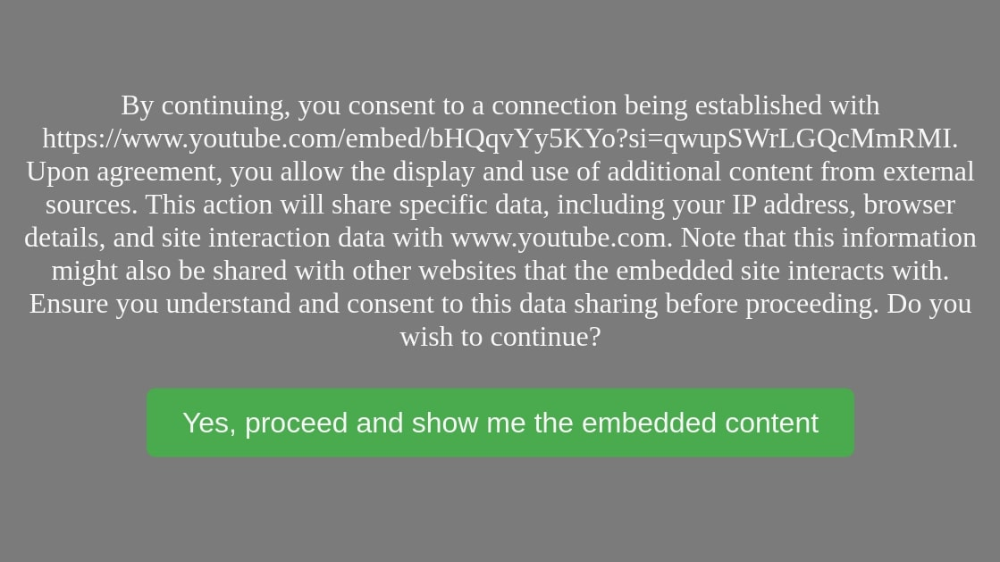

[](https://github.ci.fossalyze.de/repos/1)

# Privacy Friendly iFrame

The `<iframe>` tag will transmit user data (by making a request on behalf of the user) to the website specified in the `src`-attribute and potentially more websites as they are loaded by the iframed-website. If the user has not accepted this transfer of data you are most likely violating the General Data Protection Regulation (GDPR) or other data privacy laws.

This project provides a near drop-in replacement for the iframe tag as a webcomponent. All that needs to be done is to:

1. Load the JavaScript to register the custom element
2. Replace all `<iframe>` tags (opening and closing) with `<pf-iframe>` tags
3. Change `id`, `class` and `name` that should be positioned on the `<iframe>` to `iframe-id`, `iframe-class` and `iframe-name` respectively.

By default, the user will be asked and informed about the transfer of information before it occurs. However, you can also customize the appearance and behavior accordingly.

## Download

You can download this software on the [release page](https://github.com/FOSSalyze/privacy-friendly-iframe/releases). The README will assume the usage of the production output.

## Example Usage

There are currently no provided builts for this project. The output, however, will be a JavaScript file which will register custom elements and a CSS file which will provide styling. Assuming you have both on the root directory of the same webserver as `/pf-iframe.min.js` and `/pf-iframe.min.css` along with an English translation under `/translations/en.min.js` then you could import these in the following way:

```html
<head>
    <!-- ... your other header code ... -->
    <script src="/translations/en.min.js"></script>
    <script src="/pf-iframe.min.js"></script>
    <link rel="stylesheet" href="/pf-iframe.min.css"><link>
</head>
```

Then you can simply use the `<pf-iframe>` in your code as though it is normal `<iframe>`.

```html
<body>
        <pf-iframe width="560" height="315" src="https://www.youtube.com/embed/bHQqvYy5KYo?si=qwupSWrLGQcMmRMI" title="YouTube video player" frameborder="0" allow="accelerometer; autoplay; clipboard-write; encrypted-media; gyroscope; picture-in-picture; web-share" allowfullscreen></pf-iframe>
</body>
```

You will now see a consent screen before any data is transmitted to the iframe target and only a click on "Yes" will resolve that.



## Customization

The Privacy Friendly iFrame can be customized by placing the respective information on the window element. The configuration can be specified as `default` - meaning it will apply to all `<pf-iframe>` elements - or be given by id resulting in only the `<pf-iframe>` element being affected that has the given id. When both are specified then configuration are merged whereby the id-specific configuration has priority and will cancel out a default configuration. The fallback configuration, that applies if no configuration is passed can be found under [./src/configuration.ts](./src/configuration.ts).

Every single configuration can be overwritten. For example if you would like to log when consent has been given you can do it in the following way with the default variant:

```html
<head>
    <script lang="js">
        window._pfiFrameConfig = {
            default: {
                onConsent: (self) => {console.log('Consent has been given')},
            },
        };
    </script>
    <!-- This script should ideally be loaded after the config on the window object has been set -->
    <script src="/translations/en.min.js"></script>
    <script src="/pf-iframe.min.js"></script>
    <link rel="stylesheet" href="/pf-iframe.min.css"><link>
</head>
```

Specifically, for one id it would be passed like provided like this:

```html
<head>
    <script lang="js">
        window._pfiFrameConfig = {
            byId: {
                exampleId: {
                    onConsent: (self) => {console.log('Consent has been given')},
                },
            },
        };
    </script>
    <!-- This script should ideally be loaded after the config on the window object has been set -->
    <script src="/translations/en.min.js"></script>
    <script src="/pf-iframe.min.js"></script>
    <link rel="stylesheet" href="/pf-iframe.min.css"><link>
</head>
<body>
        <pf-iframe id="exampleId" width="560" height="315" src="https://www.youtube.com/embed/bHQqvYy5KYo?si=qwupSWrLGQcMmRMI" title="YouTube video player" frameborder="0" allow="accelerometer; autoplay; clipboard-write; encrypted-media; gyroscope; picture-in-picture; web-share" allowfullscreen></pf-iframe>
</body>
```

## Changing the Consent Screen Template

The consent screen template is generated by a function that can be easily substituted and receives the `width`, `height`, `src` and the HTML element itself.

The `width`, `height` and `src` will be the same as attribute values that have been passed to the iframe. When they are not given they will default to a value:

- `width` will default to `300`
- `height` will default to `150`
- `src` will default to `ERROR`

You can provide your own template by specifying the `generateConsentTemplate` function as a setting which has the following signature:

```ts
generateConsentTemplate(width: string, height: string, src: string, self: HTMLElement): string;
```

The `self` parameter will be filled with the instance of the `<pf-iframe>`. The output of the function should be HTML. The HTML is NOT sanitized by the `<pf-iframe>`!

Since the component will need to know when consent has been given and the button can be removed, it's also possible to specify the element that can be clicked on to give consent with `fetchConsentElement`:

```ts
fetchConsentElement(self: HTMLElement): HTMLElement | null;
```

While it can result in null, it should usually provide an HTML element. It will attach a `click` event listener to the provided HTML element and register content that way. The `self` parameter will also be the instance of the `<pf-iframe>` here.

Changing the template with the default scope might look as follows in code:

```html
<head>
    <script lang="js">
        window._pfiFrameConfig = {
            default: {
                generateConsentTemplate: (width, height, src, self) => `
                    <div>
                        <p>This is my desired consent screen.</p>
                        <button class="consent-button">I consent</button>
                    </div>
                `,
                fetchConsentElement: (self) => self.querySelector('button.consent-button'), 
            },
        };
    </script>
    <!-- This script should ideally be loaded after the config on the window object has been set -->
    <script src="/translations/en.min.js"></script>
    <script src="/pf-iframe.min.js"></script>
    <link rel="stylesheet" href="/pf-iframe.min.css"><link>
</head>
```

This custom element does not create a shadow DOM so the styling can simply be done via CSS without any further considerations. When modifying the design without modifying the template one can resort to the default style as a starting point [here](./src/pf-iframe.css). The component contains no styling itself.

## Translations

When the **template generation has not been customized** one can provide their own translation as well by using the window object.

<head>
    <script lang="js">
        window._pfiFrameConfig = {
            translation: {
                consentPromptMessage: 'My custom consent message. This is the entire URL: ${src}. This is only the domain: ${domain}.',
                consentButtonLabel: 'My custom consent label. It can also display the full URL (${src}) and domain (${domain}).'
            }
        };
    </script>
    <!-- This script should ideally be loaded after the config on the window object has been set -->
    <!--Note, that you do not need the translation file anymore-->
    <script src="/pf-iframe.min.js"></script>
    <link rel="stylesheet" href="/pf-iframe.min.css"><link>
</head>

Within the translation you can use special values which will be replaced with the respective value:

- `${src}` - The full, unaltered src given to `<pf-iframe>`
- `${domain}` - The domain of the given src. For example: `www.youtube.com`

When you provide your custom translation in this way, you should not use the translation files that are included as they could overwrite your translations and increase the load size on the user end.

You will find the available translations under [./src/translations](./src/translations).

## Using Outside Consent Sources

Other tools can be integrated and consent can be saved stored and reapplied with the Privacy Friendly iFrame. Key to that are  `onConsent` and `checkExistingConsent` which have the following signatures:

```ts
onConsent(self: HTMLElement): any;
checkExistingConsent(self: HTMLElement): boolean;
```

The `self` will provide the `<pf-iframe>` instance. The return value of `onConsent` has no effect. The return value of `checkExistingConsent` determines whether the consent screen will be shown.

For example, consent on the basis of the `src` value could be done in the following way:

```html
<head>
    <script lang="js">
        const consentLocalStorageKey = 'pf-iframe-constented-urls';
        window._pfiFrameConfig = {
            default: {
                onConsent: (self) => {
                    const srcUrl = self.getAttribute('src');
                    if(srcUrl != null) {
                        const consentedUrls = JSON.parse(localStorage.getItem(consentLocalStorageKey) ?? '[]');
                        localStorage.setItem(consentLocalStorageKey, JSON.stringify([...consentedUrls, srcUrl]));
                    }
                },
                checkExistingConsent: (self) => {
                    const srcUrl = self.getAttribute('src');
                    if(srcUrl == null) {
                        return false;
                    }
                    const consentedUrls = JSON.parse(localStorage.getItem(consentLocalStorageKey) ?? '[]');
                    return consentedUrls.includes(srcUrl);
                }
            },
        };
    </script>
    <!-- This script should ideally be loaded after the config on the window object has been set -->
    <script src="/translations/en.min.js"></script>
    <script src="/pf-iframe.min.js"></script>
    <link rel="stylesheet" href="/pf-iframe.min.css"><link>
</head>
```

## License

This library is provided under the MIT license. Do note and respect the of inclusion of copyright and the copyright notice. This could be addressed with a separate listing on your website stating all copyrights and software components that are used. Such a site does not have to be placed prominently, but it also should not be intentionally hidden or obscured. You may also declare that this software is licensed under the MIT license instead of reciting the entire license text in order to save on file size when critical.